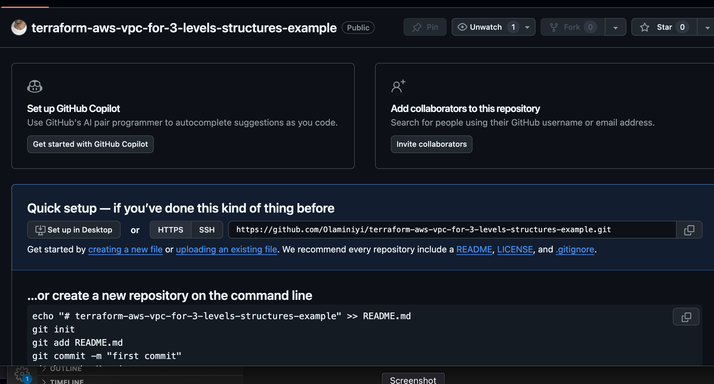
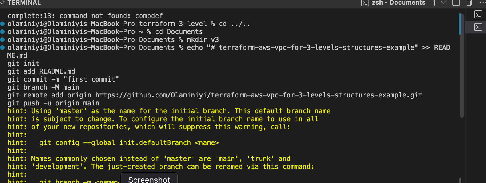
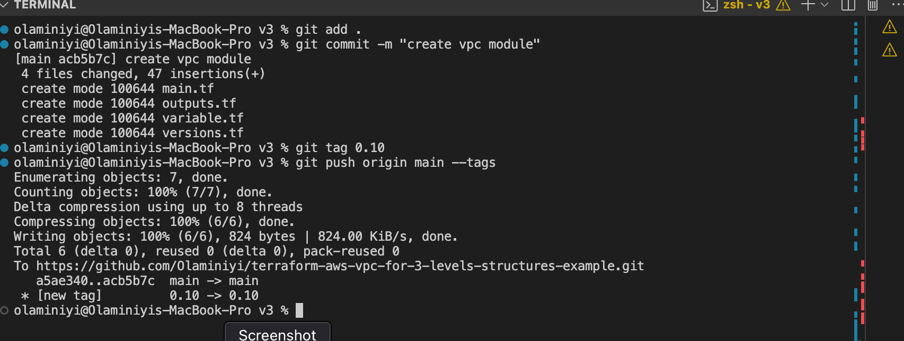
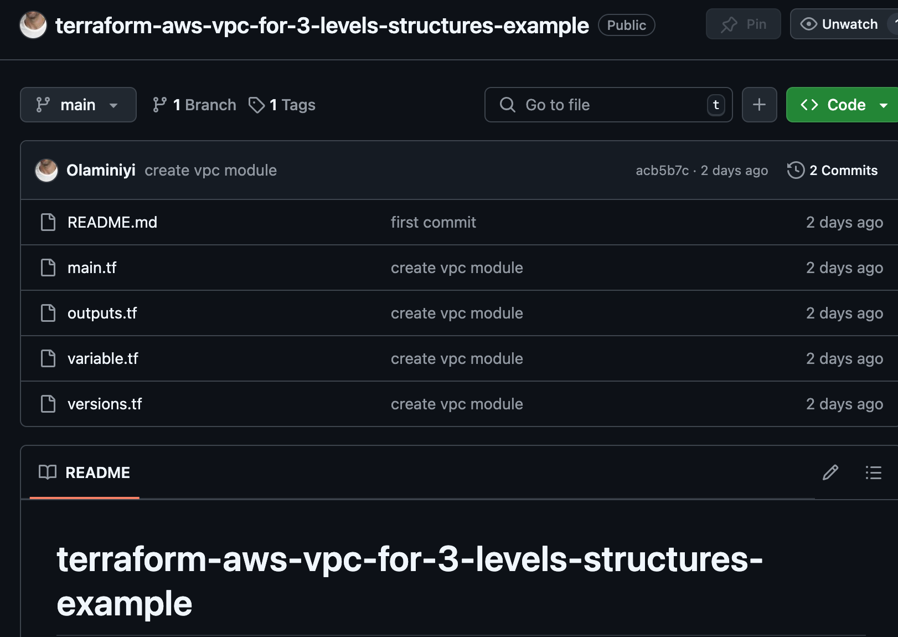
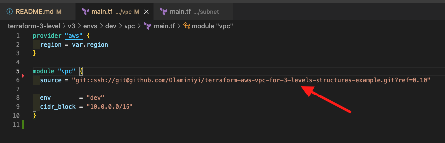
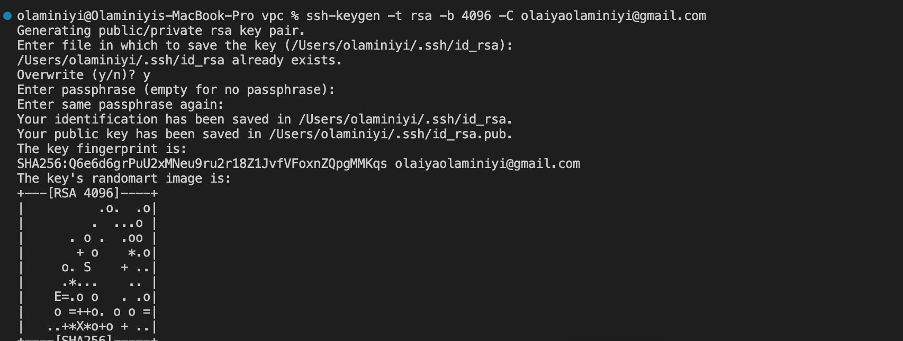
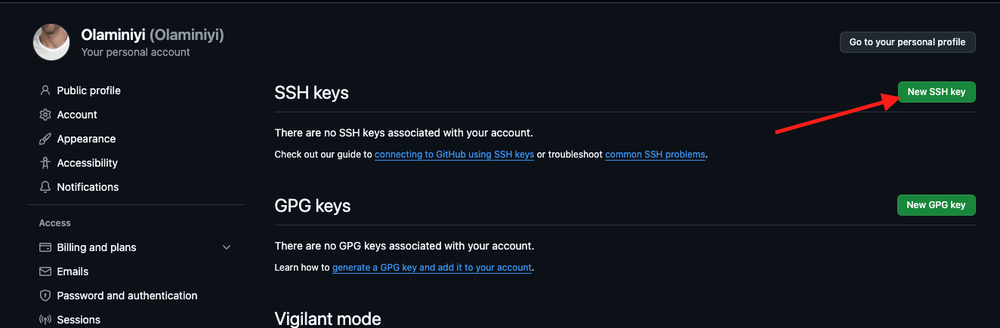
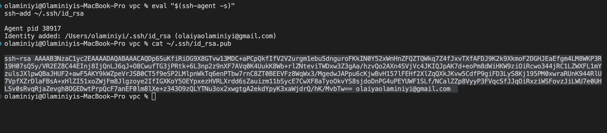
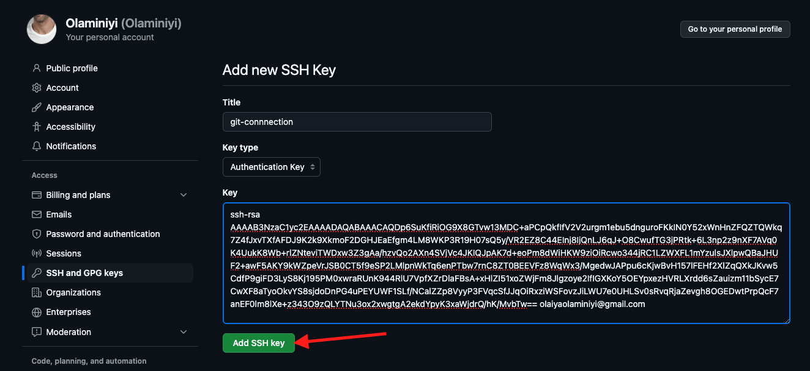
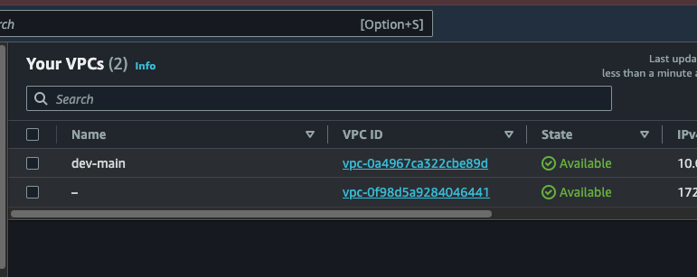

# terraform-aws-vpc-for-3-levels-structures-example

This repo is part of this [project](https://github.com/Olaminiyi/terraform-3-levels-project-structure)

The V3 structure represent the third level organisation.

As your team grows, you may decide to start using a more advanced structure. In this case, you create a git repository for each individual Terraform module. However, you need to be careful because having hundreds of modules would mean creating hundreds of git repositories. I suggest trying to create reusable modules that you can apply to different applications to minimise the number of git repositories. Using this approach, you can reference a Terraform module by using a git repository, and when you update the Terraform module, you just create a new version and use the tag in your code. Each version folder will represent a git repository for managing your Terraform project. The biggest advantage of this approach is being able to use git tags and version control from your module. Instead of referencing the local within the module, we will reference the git repository that contains the module.

Create a git repo



Clone the git repo



copy the vpc-V2 files under module folder

commit it and push to the repo

> [!NOTE]
> we are adding tag to our commit to represent a version of the infrastructure configuration inside the module. 

This tag we be reference when we want to create our resources.





In the v3 folder, to create our vpc, we will reference the git repository that contains the module using the tag to specify the particular version we are using.



You may need to set up a SSH key for your Github account to get this work. Follow these steps

Generate a new SSH key (if you don't have one):
```
ssh-keygen -t rsa -b 4096 -C "your_email@example.com"
```
Press enter to accept the default location for the key (~/.ssh/id_rsa).

Add the SSH key to your SSH agent:
```
eval "$(ssh-agent -s)"
ssh-add ~/.ssh/id_rsa
```




Add your SSH public key to GitHub: 

Go to your GitHub SSH settings and click New SSH Key.




Copy the contents of your public key to your clipboard:

```
cat ~/.ssh/id_rsa.pub
```


Paste the SSH key and save.



Test if it is working using this command:

```
ssh -T git@github.com
```


From the V3 folder, inside the VPC folder

You run the terraform init, plan and apply commands.

Check your resources

The VPC



